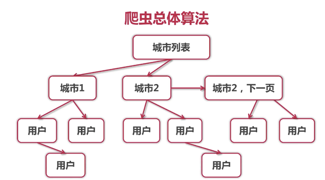
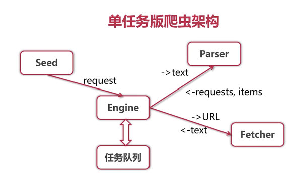
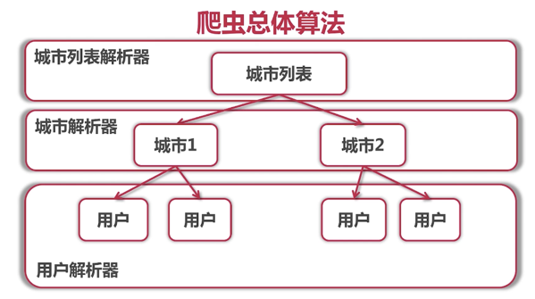

# 爬虫分类
* 通用爬虫，如 baidu, google
* 聚焦爬虫，从互联网获取结构化数据

# 爬虫算法


单任务版 => 并发版 => 分布式

# 单任务版
* 获取并打印所有城市第一页用户的详细信息

```go
package main

import (
	"bufio"
	"fmt"
	"io"
	"io/ioutil"
	"net/http"

	"golang.org/x/net/html/charset" // determine type by 1024 bytes
	"golang.org/x/text/encoding"
	"golang.org/x/text/transform" // transfer Reader
)

func determineEncoding(r io.Reader) encoding.Encoding {
	bytes, err := bufio.NewReader(r).Peek(1024)
	if err != nil {
		panic(err)
	}
	e, _, _ := charset.DetermineEncoding(bytes, "")
	return e
}

func main() {
	resp, err := http.Get("http://www.zhenai.com/zhenghun")
	if err != nil {
		panic(err)
	}

	defer resp.Body.Close()

	if resp.StatusCode != http.StatusOK {
		fmt.Println("Error: status code", resp.StatusCode)
		return
	}

	e := determineEncoding(resp.Body)
	utf8Reader := transform.NewReader(resp.Body, e.NewDecoder())
	all, err := ioutil.ReadAll(utf8Reader)
	if err != nil {
		panic(err)
	}
	fmt.Printf("%s\n", all)
}
```

# 正则表达式

```go
package main

import (
	"fmt"
	"regexp"
)

const text = `
My email is cccc@gmail.com
salkdgj is askjg@dasg.com
askgjl isadg s    kk@sa.com.cn
`

func main() {
	re := regexp.MustCompile(`([a-zA-Z0-9]+)@([a-zA-Z0-9.]+)\.([a-zA-Z0-9]+)`)
	match := re.FindAllStringSubmatch(text, -1)
	fmt.Println(match)
}

```

# 提取城市和 url

```go
package main

import (
	"bufio"
	"fmt"
	"io"
	"io/ioutil"
	"net/http"
	"regexp"

	"golang.org/x/net/html/charset" // determine type by 1024 bytes
	"golang.org/x/text/encoding"
	"golang.org/x/text/transform" // transfer Reader
)

func determineEncoding(r io.Reader) encoding.Encoding {
	bytes, err := bufio.NewReader(r).Peek(1024)
	if err != nil {
		panic(err)
	}
	e, _, _ := charset.DetermineEncoding(bytes, "")
	return e
}

func printCityList(contents []byte) {
	re := regexp.MustCompile(`<a href="(http://www.zhenai.com/zhenghun/[0-9a-z]+)"[^>]*>([^<]+)</a>`)
	matches := re.FindAllSubmatch(contents, -1)
	for _, m := range matches {
		fmt.Printf("City: %s, URL: %s\n", m[2], m[1])
	}
	fmt.Printf("Matches found: %d\n", len(matches))
}

func main() {
	resp, err := http.Get("http://www.zhenai.com/zhenghun")
	if err != nil {
		panic(err)
	}

	defer resp.Body.Close()

	if resp.StatusCode != http.StatusOK {
		fmt.Println("Error: status code", resp.StatusCode)
		return
	}

	e := determineEncoding(resp.Body)
	utf8Reader := transform.NewReader(resp.Body, e.NewDecoder())
	all, err := ioutil.ReadAll(utf8Reader)
	if err != nil {
		panic(err)
	}

	printCityList(all)
}

```

# 单任务爬虫架构






## 解析器
* 输入： utf-8 编码的文本
* 输出： Request{URL, 对应 Parser}列表，Item 列表


# 并发版爬虫
