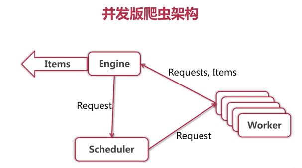
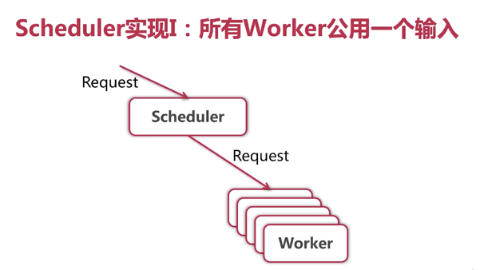
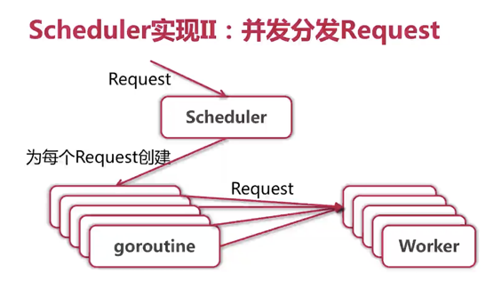
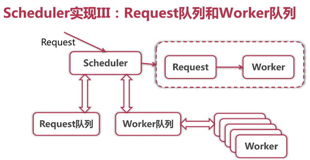
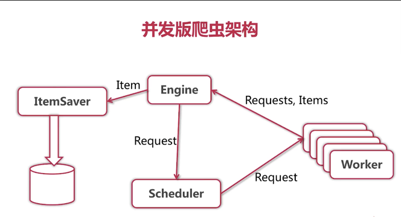
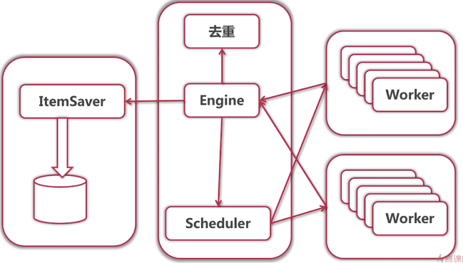

# 爬虫分类
* 通用爬虫，如 baidu, google
* 聚焦爬虫，从互联网获取结构化数据

# 爬虫算法


单任务版 => 并发版 => 分布式

# 单任务版
* 获取并打印所有城市第一页用户的详细信息

```go
package main

import (
	"bufio"
	"fmt"
	"io"
	"io/ioutil"
	"net/http"

	"golang.org/x/net/html/charset" // determine type by 1024 bytes
	"golang.org/x/text/encoding"
	"golang.org/x/text/transform" // transfer Reader
)

func determineEncoding(r io.Reader) encoding.Encoding {
	bytes, err := bufio.NewReader(r).Peek(1024)
	if err != nil {
		panic(err)
	}
	e, _, _ := charset.DetermineEncoding(bytes, "")
	return e
}

func main() {
	resp, err := http.Get("http://www.zhenai.com/zhenghun")
	if err != nil {
		panic(err)
	}

	defer resp.Body.Close()

	if resp.StatusCode != http.StatusOK {
		fmt.Println("Error: status code", resp.StatusCode)
		return
	}

	e := determineEncoding(resp.Body)
	utf8Reader := transform.NewReader(resp.Body, e.NewDecoder())
	all, err := ioutil.ReadAll(utf8Reader)
	if err != nil {
		panic(err)
	}
	fmt.Printf("%s\n", all)
}
```

# 正则表达式

```go
package main

import (
	"fmt"
	"regexp"
)

const text = `
My email is cccc@gmail.com
salkdgj is askjg@dasg.com
askgjl isadg s    kk@sa.com.cn
`

func main() {
	re := regexp.MustCompile(`([a-zA-Z0-9]+)@([a-zA-Z0-9.]+)\.([a-zA-Z0-9]+)`)
	match := re.FindAllStringSubmatch(text, -1)
	fmt.Println(match)
}

```

# 提取城市和 url

```go
package main

import (
	"bufio"
	"fmt"
	"io"
	"io/ioutil"
	"net/http"
	"regexp"

	"golang.org/x/net/html/charset" // determine type by 1024 bytes
	"golang.org/x/text/encoding"
	"golang.org/x/text/transform" // transfer Reader
)

func determineEncoding(r io.Reader) encoding.Encoding {
	bytes, err := bufio.NewReader(r).Peek(1024)
	if err != nil {
		panic(err)
	}
	e, _, _ := charset.DetermineEncoding(bytes, "")
	return e
}

func printCityList(contents []byte) {
	re := regexp.MustCompile(`<a href="(http://www.zhenai.com/zhenghun/[0-9a-z]+)"[^>]*>([^<]+)</a>`)
	matches := re.FindAllSubmatch(contents, -1)
	for _, m := range matches {
		fmt.Printf("City: %s, URL: %s\n", m[2], m[1])
	}
	fmt.Printf("Matches found: %d\n", len(matches))
}

func main() {
	resp, err := http.Get("http://www.zhenai.com/zhenghun")
	if err != nil {
		panic(err)
	}

	defer resp.Body.Close()

	if resp.StatusCode != http.StatusOK {
		fmt.Println("Error: status code", resp.StatusCode)
		return
	}

	e := determineEncoding(resp.Body)
	utf8Reader := transform.NewReader(resp.Body, e.NewDecoder())
	all, err := ioutil.ReadAll(utf8Reader)
	if err != nil {
		panic(err)
	}

	printCityList(all)
}

```

# 单任务爬虫架构


## 解析器
* 输入： utf-8 编码的文本
* 输出： Request{URL, 对应 Parser}列表，Item 列表


# 并发版爬虫




*上图会有循环等待的问题*






# 去重
* hash
* md5 + hash
* bloom filter
* redis

# 如何存储 Items
* 抽象出 Task 的概念
  * FetchTask
  * PersistTask
  * 但是在该项目中显得太重了

* 为每个 Item 创建 goroutine，提交给 ItemSaver，类似 SimpleScheduler 的做法：




# elastic
```
docker run -d -p 9200:9200 elasticsearch
```

/index/type/id

* index: database
* type: table
* id: id

# 分布式系统
* 多个节点
    * 容错性
    * 可拓展性
    * 固有分布性
* 消息传递
    * 节点有私有存储
    * 易于开发
    * 可拓展
    * 对比并行运算
* 完成特定需求


## 分布式爬虫架构
这里去重后面实现改为worker来调用



## 去重问题
* 单节点能承受的去重数据量有限
* 无法保存之前去重结果

## 存储问题
* 技术栈与爬虫部分区别很大


## jsonrpc

*rpcdemo*
```go
package rpcdemo

import "errors"

// Service.Method
type DemoService struct {}

type Args struct {
	A, B int
}

func (DemoService) Div(args Args, result *float64) error {
	if args.B == 0 {
		return errors.New("division by zero")
	}

	*result = float64(args.A) / float64(args.B)
	return nil
}
```

*main*
```go
package main

import (
	"net/rpc"
	"./rpcdemo"
	"net"
	"log"
	"net/rpc/jsonrpc"
)

func main() {
	rpc.Register(rpcdemo.DemoService{})
	listener, err := net.Listen("tcp", ":1234")
	if err != nil {
		panic(err)
	}

	for {
		conn, err := listener.Accept()
		if err != nil {
			log.Printf("accept error: %v", err)
		}

		go jsonrpc.ServeConn(conn)
	}
}
```

启动服务，然后 `telnet localhost 1234`, 输入：

```
{"mehtod":"DemoService.Div","params":[{"A":3,"B":4}],"id":1}
```

