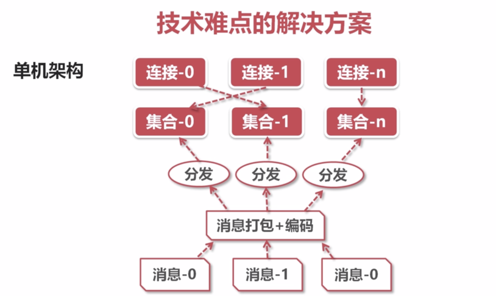

# 技术难度
## 内核瓶颈
* 推送量大：100 万在线 * 10 条/秒 = 1000 万条/秒
* 内核瓶颈：linux 内核发送 tcp 的极限包频 ≈ 100 万/秒

**减少网络小包的发送，将多条消息合并发送**

## 锁瓶颈
* 维护用户集合，遍历发送消息
* 推送期间，客户端正常上下线，所以集合需要上锁

**把集合打散，多线程并发推送**

**读写锁取代互斥锁**

## cpu 瓶颈
* json 编码

**减少重复计算**

# 单机架构

* 维护长连接需要不少*内存*
* 消息推送需要消耗大量*cpu*资源
* 消息推送*带宽*高达400~600mb，是主要瓶颈

# 分布式架构
